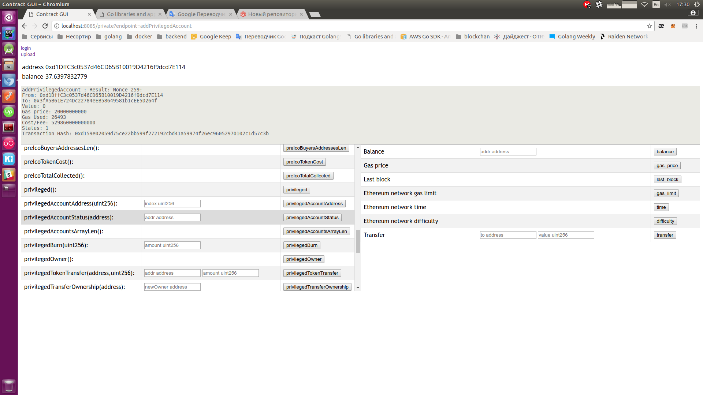

###Description
A small application for testing smart contracts:
1) compiles .sol files.
2) work with smart contracts
3) functions for working with the Etherium
4) this can be work simultaneously with different contracts
5) the function of the login on a private key
